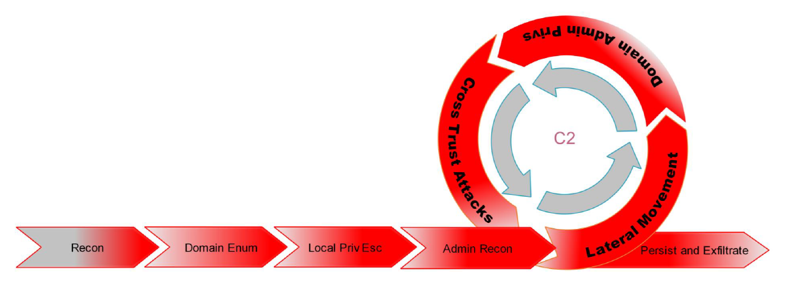

[Home](https://docs.ad-attacks.com) | [Projects](./website/Projects.md) | [Discord](./website/Discord.md)| [Author](./website/Author.md) | [Contact](./website/Contact.md)

# Active Directory Penetration Testing

Welcome to the Active Directory Attacks Documentation for Red Teams!

This documentation serves as a comprehensive resource for understanding various attack techniques and vulnerabilities associated with Active Directory environments. Whether you are a security professional, system administrator, or simply interested in learning about cybersecurity, this documentation will provide valuable insights into the risks and countermeasures related to Active Directory attacks.

In this documentation, you will find detailed explanations of different attack techniques employed by malicious actors to compromise Active Directory infrastructures. We cover well-known techniques such as Pass-the-Hash, Golden Ticket, Kerberoasting, and more. Each attack technique is accompanied by a description, potential impact, detection methods, and recommended mitigation strategies.

My aim is to help you understand the inner workings of these attacks, enabling you to identify vulnerabilities within your own Active Directory environment and implement effective security measures to protect against them. Additionally, we provide real-world examples and practical guidance to enhance your understanding of the attack vectors and their implications.

We encourage you to explore the various sections of this documentation, where you will find detailed explanations, step-by-step guides, and recommended best practices to secure your Active Directory infrastructure. Stay one step ahead of potential threats and bolster your organization's security posture with the knowledge gained from this documentation.

Remember, a well-informed defender is better equipped to safeguard their Active Directory environment against malicious actors. Let's dive in and strengthen our defenses against Active Directory attacks!

Happy learning and stay secure!

- [Author RFS](https://author.popdocs.net/)

## Learn Active Directory

| Header 1 | Header 2 | Header 3 |
| -------- | -------- | -------- |
| Cell 1   | Cell 2   | Cell 3   |
| Cell 4   | Cell 5   | Cell 6   |
| Cell 7   | Cell 8   | Cell 9   |

## Windows Attack Scenarios

| Scenario | Description | LAB design |
| -------- | -------- | -------- |
| Windows Client   | Cell 2   | Cell 3   |
| Windows Client with AD   | Cell 5   | Cell 6   |
| Windows Server Standalone   | Cell 8   | Cell 9   |
| Windows Server with AD   | Cell 8   | Cell 9   |
| Active Direcory Environment  | Cell 8   | Cell 9   |
| Active Direcory Multi Forest Environment  | Cell 8   | Cell 9   |

## Active Directory External Reconnaissance

Active Directory (AD) External Reconnaissance is a methodology used to gather information and assess the security posture of an organization's Active Directory infrastructure from an external perspective. 

## Active Directory Attacks Theory

- Initial Compromise
- Host Reconnaissance
- Domain Enumeration
- Local Privilege Escalation
- Administrator Enumeration
- Lateral Movement
- Domain Admin privs
- Cross Trust Attacks
- Domain Persistence
- Exfiltrate

## Active Directory Attacks by Service Type (Protocol)

| Protocol | Port | Description |
| -------- | -------- | -------- |
| [NetBIOS](./NetBIOS)   | Cell 2   | Cell 3   |
| [DNS](./DNS/index.md)  | 53   | Cell 6   |
| [MsSQL](./MSSQL/index.md)  | Cell 8   | Cell 9   |
| [LDAP](./LDAP/index.md)  | Cell 8   | Cell 9   |
| [Kerberos](./Kerberos/index.md)  | Cell 8   | Cell 9   |
| [Samba](./Samba/index.md)  | 445   | Cell 9   |
| [IIS](./IIS/index.md) | 80 / 443   | Cell 9   |
| [Exchange](./Exchange/index.md)  | Cell 8   | Cell 9   |
| [WinRM](./WinRM/index.md) | Cell 8   | Cell 9   |
| [SCCM](./SCCM/index.md) | Cell 8   | Cell 9   |

## My Tools Arsenal Documentation

| Tool    | Description | Documentation     |
| ------- | --- | ------------ |
| Nmap    | 25  | [Nmap]()     |
| CrackMapExec   | 30  | [CrackMapExec](https://crackmapexec.popdocs.net/)  |
| Rubeus   | 40  | [Rubeus]()       |
| Certify | Text | [Certify]() |
| Mimikatz | Text | [Mimikatz]() |
| BloodHound | Text | [BloodHound](https://bloodhound.popdocs.net/) |
| DeathStar | Text | [DeathStar]() |
| Metasploit | Text | [Metasploit]() |
| Empire | Text | [Empire]() |
| Covenant | Text | [Covenant]() |
| Cobal Strike | Text | [Cobal Strike]() |
| Tool | Text | Docs |
| Tool | Text | Docs |
| Tool | Text | Docs |

## Windows Privilege Escalation

## Domain Privilege Escalation

- Attack Privilege Requirements
- Kerbrute Enumeration — No domain access required
- Pass the Ticket — Access as a user to the domain required
- Kerberoasting — Access as any user required
- AS-REP Roasting — Access as any user required
- Golden Ticket — Full domain compromise (Domain Admin) required
- Silver Ticket — Service hash required
- Skeleton Key — Full domain compromise (Domain Admin) required

## AD Attacks

| Attack Technique       | Description                                                                                                                                                                       |
| ------------------------ | ----------------------------------------------------------------------------------------------------------------------------------------------------------------------------------- |
| Pass-the-Hash          | An attack where an attacker steals the hash of a user's password and uses it to authenticate and impersonate the user.                                                           |
| Golden Ticket          | A technique that allows an attacker to forge Kerberos tickets, granting them unauthorized access with domain-level privileges.                                                   |
| Kerberoasting          | Exploits the weak encryption of Kerberos ticket-granting tickets (TGTs) to extract the password hashes of Active Directory service accounts.                                       |
| BloodHound             | A tool used to identify and exploit Active Directory trust relationships, exposing potential attack paths and lateral movement opportunities.                                       |
| DCShadow               | An attack that manipulates domain controllers to create a rogue domain controller, allowing attackers to stealthily inject changes into the Active Directory infrastructure.           |
| Skeleton Key           | A technique that allows an attacker to bypass authentication by injecting a backdoor password into Active Directory, granting them unauthorized access.                          |
| Silver Ticket          | Similar to a Golden Ticket, but instead of compromising the Key Distribution Center (KDC), it targets specific service principals, granting unauthorized access to specific services. |

## More Documentation

- [Active Directory Penetration Testing](https://github.com/PopLabSec/Active-Directory-Penetration-Testing)
- [Infrastructure Penetration Testing]()
- [Networks Penetration Testing](https://github.com/PopLabSec/Networking-Penetration-Testing)
- [Web Applications Penetration Testing](https://github.com/PopLabSec/Web-Applications-Penetration-Testing)
- [Wireless Security](https://www.offensive-wireless.com/)
- [Ethical Hacking](https://github.com/PopLabSec/RFS-Ethical-Hacking)

## Certifications Guides

- [CRTO-Exam-Guide](https://github.com/PopLabSec/CRTO-Exam-Guide)
- [OSCP Study Guide 2023](https://github.com/PopLabSec/OSCP-Study-Guide-2023)
- [eJPT Study Guide](https://github.com/PopLabSec/eJPT-Study-Guide)
- [eCPPTv2 AIO](https://github.com/PopLabSec/eCPPTv2-AIO)
